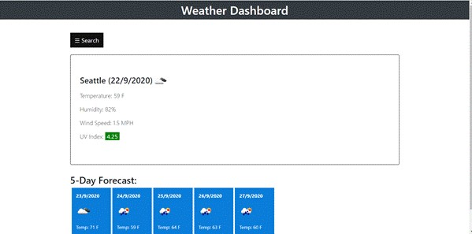
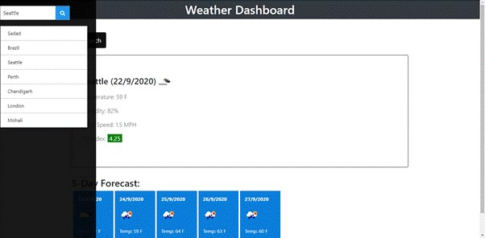

# Weather Dashboard

## User Story

AS A traveler
I WANT to see the weather outlook for multiple cities
SO THAT I can plan a trip accordingly

## Description

This mobile-reponsive application displays the current weather and 5-day forecast of the input city.

## Tools & Technologies 

- Open Weather Map API 
- jQuery
- Bootstrap
- HTML/CSS
- Git
- VS Code

## Visuals

## Project Status

Ongoing...

## <a href="https://prabhm512.github.io/weather-dashboard/" target="_blank">Deployed Project (click to view)</a>
